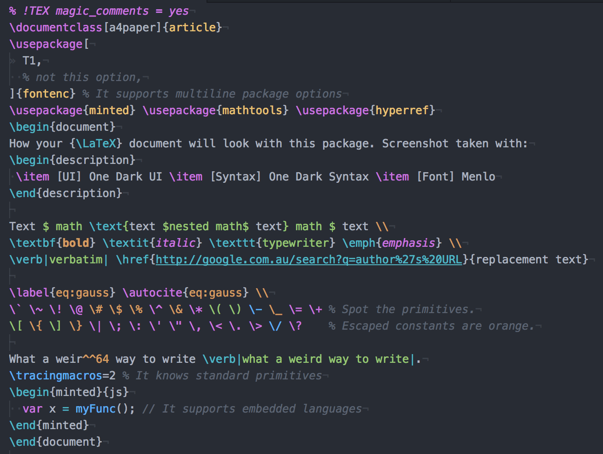

[See this on atom.io](https://atom.io/packages/language-latex2e)
# language-latex2e package



This package is a replacement for the already existing [`language-latex`](https://atom.io/packages/language-latex) package. The design philosophy is if it is valid LaTeX, it gets correct syntax highlighting (within reason). For example, it will correctly highlight the optional arguments to `\usepackage`.


NOTE: `bibtex` has a different syntax to `biber`. I have added `bibtex` support, not `biber` support as of writing this. If you're using `biblatex` for citations, and you haven't explicity set `backend=bibtex`, then you are using `biber`.

## Current Status

Most features available in `language-latex` have been implemented, so all that remains is to tidy up the grammar rules. If you think you can help in anyway, feel free to go to the GitHub page and raise an issue or submit a pull request.

## Installation

The package will scope grammar if it is installed through Atom like any other package. You may find that [`language-latex`](https://atom.io/packages/language-latex) (if installed) needs to be disabled for this one to work properly.

## Tips
This package supports a new [magic comment](https://tex.stackexchange.com/questions/78101/when-and-why-should-i-use-tex-ts-program-and-tex-encoding) of the form
```latex
% !TEX syntax = value
```
See [the documentation](docs/magic_comments.md) for details.

## Setup
These sections detail how to set up the spell checking, linting and formatting packages.

### Snippets

Snippets have been removed from this package. To get them back ~~mail ₿10 by carrier swallow (African) to the following offshore location~~ you can install my other package [`autocomplete-latex`](https://atom.io/packages/autocomplete-latex), or any other completion package you like.

### Spell checking

I recommend using the package [`linter-spell`](https://atom.io/packages/linter-spell) to manage spell checking. You will need a version of Aspell or Hunspell on your system, see the package itself for more help. One thing to make sure of is that you specify the absolute path for Hunspell | Aspell.

In addition, you need the package [`linter-spell-latex`](https://atom.io/packages/linter-spell-latex) (this provides the LaTeX specific information to `linter-spell`, which is the general spell checking package). If the package is not activating, a quick fix is to make the change seen [here](https://github.com/AtomLinter/linter-spell-latex/pull/28/files). To confirm if the package is active, you can paste the following function into the dev tools console (`View -> Developer -> Toggle Developer Tools`)
```
!!atom.packages.getActivePackage("linter-spell-latex")
```
If it returns `true`, then it's active. If false, it's not active. Simples. \*\*insert meerkat sounds\*\*.

If things are being spell checked that shouldn't, first make sure it doesn't happen with `language-latex`. If the issue is unique to this package, make an issue [here](https://github.com/Aerijo/language-latex2e/issues). If both packages have the same spell checking issue, make the issue at `linter-spell-latex`, and the maintainers there can redirect you if necessary. Always make sure your issue isn't already there before starting a new one.


### Chktex

[`linter-chktex`](https://atom.io/packages/linter-chktex) should work out of the box, assuming you have the full TeXLive install (and if you don't, I'll assume you know enough to install the `chktex` package yourself).

However, you may not see the linting: in this case, make sure you have both [`linter`](https://atom.io/packages/linter) and [`linter-ui-default`](https://atom.io/packages/linter-ui-default) installed and enabled.

### Beautify

The only problem here is getting `latexindent` (part of TeXLive install) to work. I resorted to installing a Perl Package manager, and tried running the terminal command `latexindent` and installing the package required by the error message until it worked. It seemed to be `YAML::tiny` and some Unicode package it needed.

- **Note**: The Atom package will not give a very informative error message, so be sure to get it working in the command line first.
